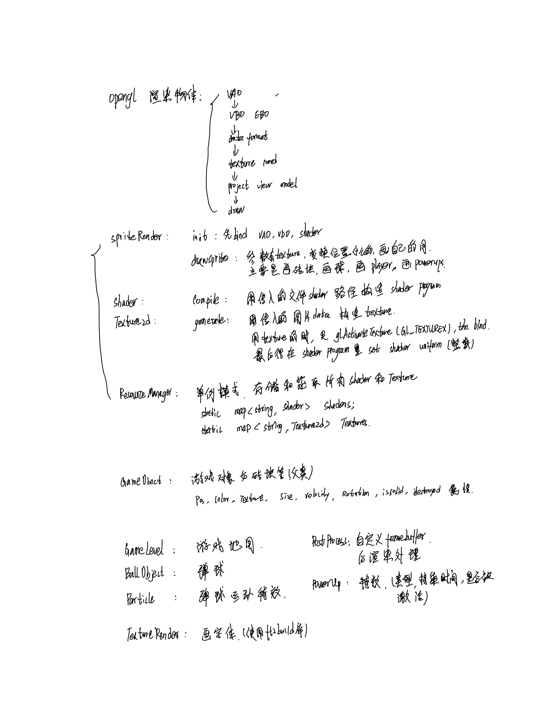
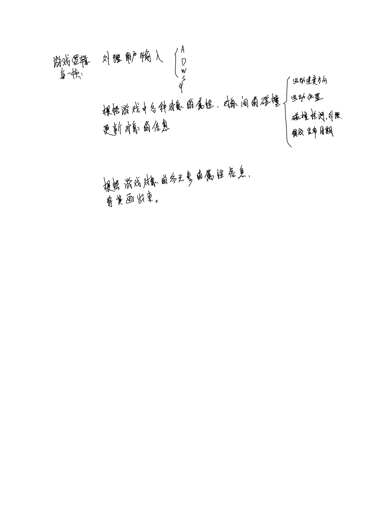

# Opengl Breakout Game - Learn from LearnOpenGL

## Used Libraries, Platform Ubuntu 20.04
* Installed in linux
1. glfw
2. GLEW
3. GL
4. SOIL - Simple OpenGL Image Library
5. GLM - OpenGL Mathematics
* Under thirds directory
6. freetype - Text Render library
7. irrKlang - Open Source Sound library

## Build && Run
```
Step into dir where CMakeists.txt located and code in: 

cmake -B build && cmake --build build
./Breakout 
```

If success, terminal shows like:
```bash
-- The C compiler identification is GNU 11.4.0
-- The CXX compiler identification is GNU 11.4.0
-- Check for working C compiler: /usr/bin/cc
-- Check for working C compiler: /usr/bin/cc -- works
-- Detecting C compiler ABI info
-- Detecting C compiler ABI info - done
-- Detecting C compile features
-- Detecting C compile features - done
-- Check for working CXX compiler: /usr/bin/c++
-- Check for working CXX compiler: /usr/bin/c++ -- works
-- Detecting CXX compiler ABI info
-- Detecting CXX compiler ABI info - done
-- Detecting CXX compile features
-- Detecting CXX compile features - done
-- Configuring done
-- Generating done
-- Build files have been written to: /home/szt/projects/2d_BreakOut/build
Scanning dependencies of target Breakout
[  7%] Building CXX object CMakeFiles/Breakout.dir/src/BallObject.cpp.o
[ 15%] Building CXX object CMakeFiles/Breakout.dir/src/Game.cpp.o
[ 23%] Building CXX object CMakeFiles/Breakout.dir/src/GameLevel.cpp.o
[ 30%] Building CXX object CMakeFiles/Breakout.dir/src/GameObject.cpp.o
[ 38%] Building CXX object CMakeFiles/Breakout.dir/src/Particle.cpp.o
[ 46%] Building CXX object CMakeFiles/Breakout.dir/src/PostProcess.cpp.o
[ 53%] Building CXX object CMakeFiles/Breakout.dir/src/ResourceManager.cpp.o
[ 61%] Building CXX object CMakeFiles/Breakout.dir/src/Shader.cpp.o
[ 69%] Building CXX object CMakeFiles/Breakout.dir/src/SpriteRenderer.cpp.o
[ 76%] Building CXX object CMakeFiles/Breakout.dir/src/Texture2d.cpp.o
[ 84%] Building CXX object CMakeFiles/Breakout.dir/src/TextureRender.cpp.o
[ 92%] Building CXX object CMakeFiles/Breakout.dir/src/main.cpp.o
[100%] Linking CXX executable ../Breakout
[100%] Built target Breakout
```

## Cmake Link Libs
1. Include header or source director
2. Link libs to the executable target
3. In linux, lib is end with .so and .a
4. In windows, lib is .lib and .dll
5. In mac, lib is ???

## Recorded notes




## Collition

1. Axis-aligned bounding box (AABB) rectangle
    Only need to check the x and y axes. 我们检查第一个物体的最右侧是否大于第二个物体的最左侧并且第二个物体的最右侧是否大于第一个物体的最左侧；
    
    ```c++
    GLboolean CheckCollision(GameObject &one, GameObject &two) // AABB - AABB collision
    {
        // x轴方向碰撞？
        bool collisionX = one.Position.x + one.Size.x >= two.Position.x &&
            two.Position.x + two.Size.x >= one.Position.x;
        // y轴方向碰撞？
        bool collisionY = one.Position.y + one.Size.y >= two.Position.y &&
            two.Position.y + two.Size.y >= one.Position.y;
        // 只有两个轴向都有碰撞时才碰撞
        return collisionX && collisionY;
    }  
    ```
2. AABB circle
    use clamp to get the point nearest to circle center
    
```c++
GLboolean CheckCollision(BallObject &one, GameObject &two) // AABB - Circle collision
{
    // 获取圆的中心 
    glm::vec2 center(one.Position + one.Radius);
    // 计算AABB的信息（中心、半边长）
    glm::vec2 aabb_half_extents(two.Size.x / 2, two.Size.y / 2);
    glm::vec2 aabb_center(
        two.Position.x + aabb_half_extents.x, 
        two.Position.y + aabb_half_extents.y
    );
    // 获取两个中心的差矢量
    glm::vec2 difference = center - aabb_center;
    glm::vec2 clamped = glm::clamp(difference, -aabb_half_extents, aabb_half_extents);
    // AABB_center加上clamped这样就得到了碰撞箱上距离圆最近的点closest
    glm::vec2 closest = aabb_center + clamped;
    // 获得圆心center和最近点closest的矢量并判断是否 length <= radius
    difference = closest - center;
    return glm::length(difference) < one.Radius;
}      
```

## Self Defined FrameBuffer - Post Processing
1. We can use self defined framebuffer to store the result and then do postprocessing
2. First beging our own framebuffer
3. Then do draw like normal and end, after that the texture color will get into our self defined framebuffer
4. Then we can do postprocessing on the texture


## Music Play - IrrKlang
1. IkpFlac and ikpMP3 need to be placed in the same folder with generated Breakout file
2. Cmake include header files and link lib file libIrrKlang.so
3. Simple useage
```c++
irrklang::ISoundEngine* SoundEngine = irrklang::createIrrKlangDevice();
SoundEngine->play2D("your_music_file.mp3", true); // loop
SoundEngine->play2D("your_music_file.mp3", false); // once
```

## Text Rendering - freetype library


## Tips
1. Texture direction is flipped. Can revise fs shader program to rectify the texture direction
2. Libs (ikpFlac.so and ikpMP3.so) need to be placed in the same folder with generated Breakout file
3. If cannot see anything in opengl window, check:
    * Projection, View matrix is ignore or misused.
    * glEnable(xxx) funciton may prevent something shown up.
    * Use glGetError() to detect error hided in codes.